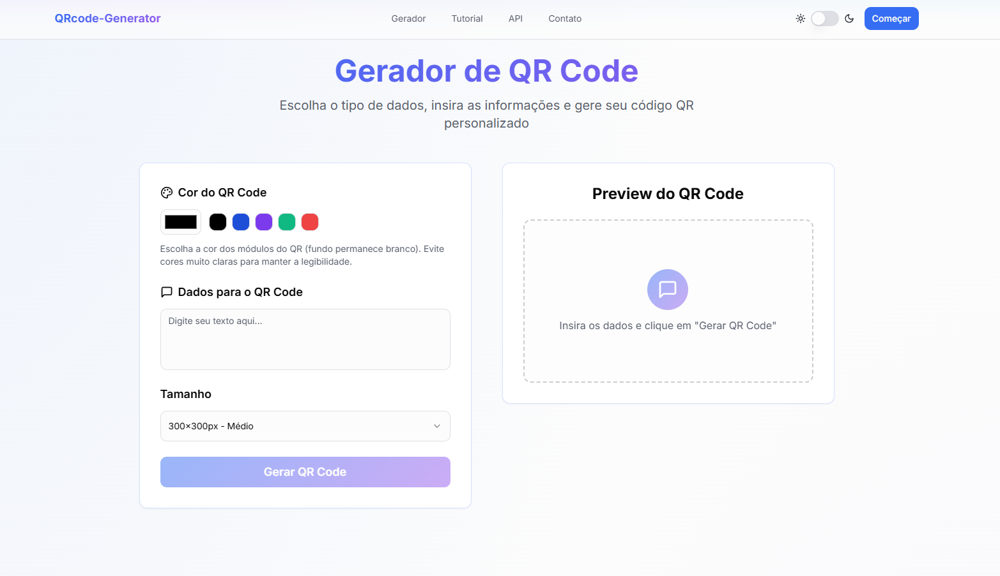

<div align="center">

# QRcode-Generator

Gerador de QR Code moderno, rápido e responsivo. Crie QR Codes para URLs, textos, e mais — com visual elegante e download em alta qualidade.

<br/>


</div>

## ✨ Recursos

- Geração instantânea de QR Codes (PNG)
- Suporte a múltiplos tipos: Texto, URL, Email, Telefone, WiFi, SMS
- Pré-visualização em tempo real
- Download em alta qualidade com 1 clique
- UI moderna com tema claro/escuro
- Animações suaves ao rolar (reveal on scroll)

## 🚀 Tecnologias

- React + TypeScript (Vite)
- Tailwind CSS + shadcn/ui
- Radix UI Primitives

## 🧭 Estrutura

```
src/
  components/        // Componentes de UI e seções
  pages/             // Páginas (Index, Privacy, Terms)
  hooks/             // hooks de utilidade (ex.: toast)
  lib/               // utilidades como métricas locais
```

## 🛠️ Começando

Pré-requisitos: Node.js 18+ e npm (ou pnpm/bun)

```bash
npm install
npm run dev
```

Servidor local: `http://localhost:5173`

### Build de produção

```bash
npm run build
npm run preview
```

## 📦 Scripts

- `dev`: inicia servidor de desenvolvimento Vite
- `build`: gera build de produção
- `preview`: pré-visualiza build localmente

## 🔐 Privacidade

- Os dados inseridos são usados apenas para gerar o QR Code no momento da ação; não armazenamos dados sensíveis.
- Utilizamos armazenamento local do navegador apenas para exibir sua contagem pessoal de QR Codes gerados. É opcional e não identifica o usuário.

## 🔗 API Utilizada

- Endpoint público: `https://api.qrserver.com/v1/create-qr-code/`
- Documentação: `https://goqr.me/api/`

## ♿ Acessibilidade

- Componentes com foco visível e rótulos apropriados
- Suporte a teclado e tema com bom contraste

## 🧩 Personalização

- Ajuste cores e tema em `src/index.css` e `tailwind.config.ts`
- Edite textos e seções em `src/components` e `src/pages`

## 📄 Licença

Este projeto é disponibilizado como está (MIT/Apache-2.0 conforme preferência do autor). 

